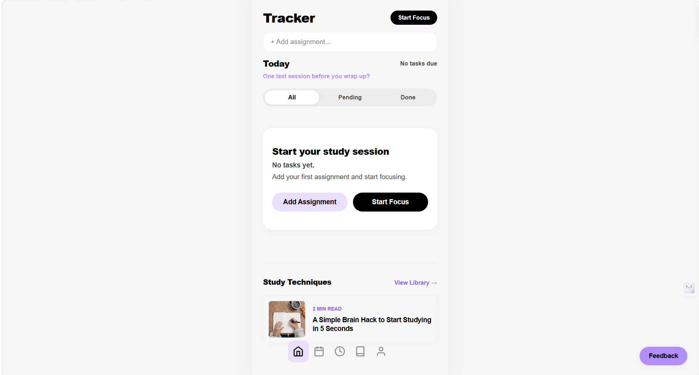
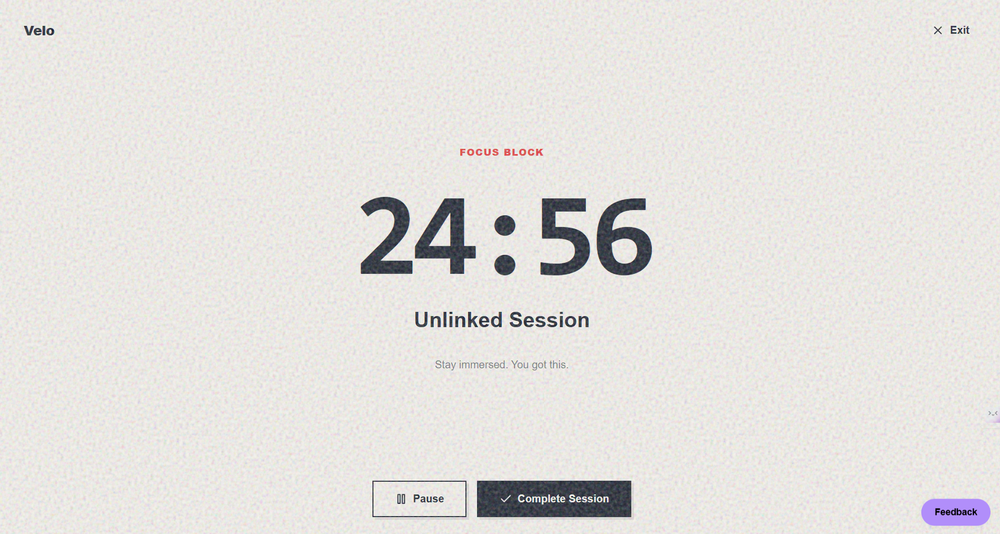
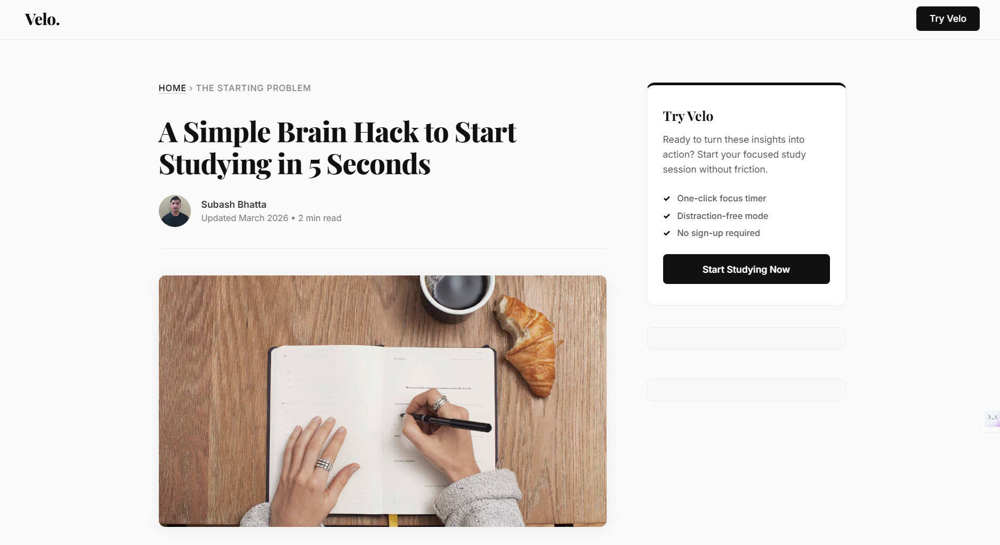

# Velo

A high-performance study companion designed to eliminate context-switching and mental friction.

Velo consolidates task management, time-blocking, and academic resources into a single, distraction-free environment. Built as a Progressive Web App (PWA), it prioritizes speed, offline reliability, and a clean, intentional interface.

## Problem

Student productivity is often compromised by the "fragmentation penalty." Switching between to-do lists, timers, and scattered references creates cognitive fatigue, leading to decreased focus and work quality.

## Solution

Velo provides a unified workspace for real academic workflows. By integrating task tracking directly with deep-work sessions, it reduces the friction between planning and execution.

## Preview

### Dashboard

The central hub for assignment tracking, showing deadlines and tasks in a prioritizable list.

### Focus Mode

A minimal, dedicated interface for deep work sessions, designed to minimize distraction.

### Built-in Study Content

An integrated editorial library featuring curated study techniques and productivity frameworks.

## Key Features

- **Integrated Assignment Logic**: Manage tasks, deadlines, and priorities without leaving the dashboard.
- **Deep Work Focus Mode**: A dedicated, distraction-free timer optimized for maximum immersion.
- **Unified Calendar**: A clear timeline of upcoming academic commitments.
- **Progress Insights**: Performance analytics to track consistency and session history.
- **PWA Engineering**: Full offline support and installable directly to the OS for instant access.
- **Frictionless Onboarding**: No accounts or sign-ups required. Your data remains local and secure.

## Tech Stack

- **Core**: Vanilla JavaScript (ESNext), HTML5, CSS3
- **Build**: Vite
- **PWA**: Service Workers with advanced caching strategies
- **Analytics**: GA4 & Microsoft Clarity for privacy-aware insights
- **Deployment**: Vercel

## How it Works

1. **Plan**: Add tasks and deadlines to the centralized tracker.
2. **Focus**: Enter Focus Mode to execute deep-work blocks.
3. **Analyze**: Review progress insights to optimize your workflow.
4. **Learn**: Access integrated study guides to sharpen your academic performance.

## Why I Built This

Most productivity tools for students are either too bloated with features that don't serve the work, or too basic to manage complex academic schedules. Velo was built for students who need a professional-grade tool that respects their focus.

## Future Roadmap

- **Multi-Device Sync**: Optional cloud synchronization with end-to-end encryption.
- **Automated Prioritization**: Smart scheduling based on task complexity and deadlines.
- **Expanded Analytics**: Visualizing long-term productivity trends and session quality.
- **Export Capabilities**: Direct export of session logs and task history.

---

Built for those who want to stop planning and start executing.
